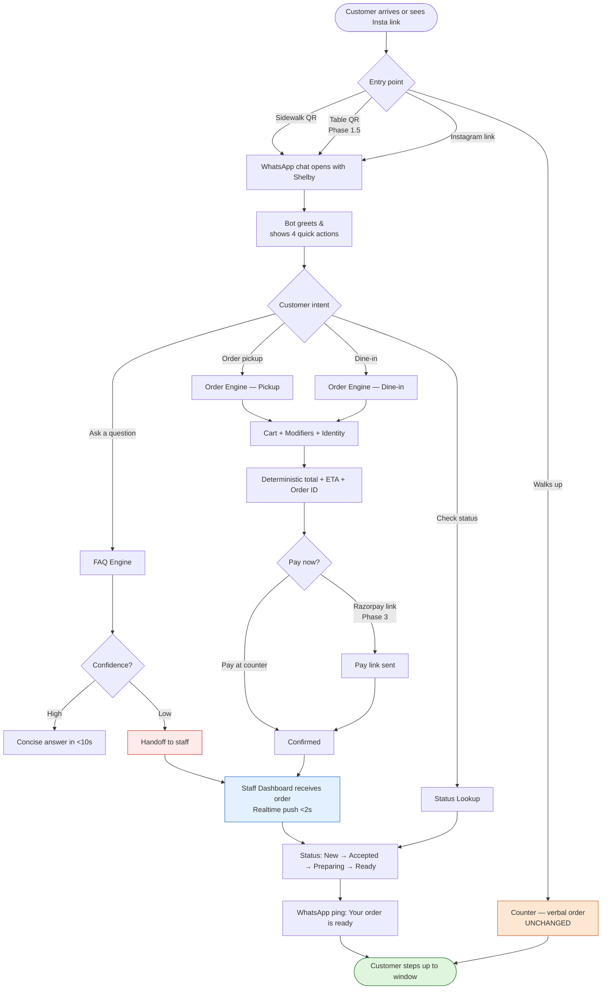
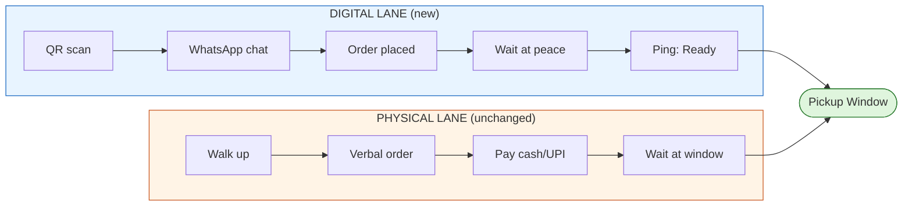
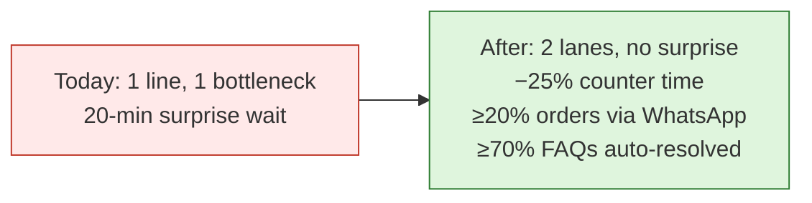

# DECK L0 — Macro / End-to-End UX Flow
*The 10,000-foot view. One picture, three phases, four customer paths. This is what the owner sees first.*

---

## Slide 1 — The headline

> **One QR. One chat. Same window. One less line.**
>
> A customer scans a QR (sidewalk / counter / table / Instagram), chats with Shelby on WhatsApp, places an order, and steps up to the window only when their drink is ready. Everything else (cash, walk-in, no-WhatsApp) keeps working exactly as it does today.

---

## Slide 2 — End-to-end flow (single diagram)

---

## Slide 3 — Three phases, plain English

### Phase 1 · Initiation & Triage
Customer scans/clicks → bot greets → 4 quick replies appear:
1. **View Menu / Order Pickup**
2. **Dine-in (table)**  *(launches in Phase 1.5)*
3. **Check Order Status**
4. **Ask a Question**

### Phase 2 · Core Processing
- **Question** → bot pulls from Shelby's approved knowledge base only.
- **Order** → menu → item → modifiers → cart → name+phone → order confirmed with **honest ETA**.
- **Status** → bot finds the customer's active order by phone number and shows live state.

### Phase 3 · Fulfillment & Handoff
- Order pops on the **barista tablet** (Kanban: New → Accepted → Preparing → Ready).
- Staff move the card; customer gets WhatsApp pings.
- **Customer steps up to the window only when "Ready"** — no crowding, no guessing.

---

## Slide 4 — The two lanes (this is the most important picture for the owner)

> **Both lanes converge at the window.** The digital lane *thins* the physical one — it never replaces it. Cash, no-WhatsApp, and "I just want to talk to a human" all keep working.

---

## Slide 5 — What changes for each role on Day 1 of pilot

| Role | Before | After |
|---|---|---|
| **Customer** | Stand in line, ask questions, guess wait time | Optional: scan QR, see ETA, get pinged |
| **Order-taker** | Verbal at window, repeats menu 100×/day | Verbal *only* for walk-ins; FAQ deflected to bot |
| **Baristas / shot puller / bun station** | Hear orders shouted | See orders on tablet, batch tea/coffee naturally |
| **Owner** | Guesses where the bottleneck is | Sees data: counter time, ETA delta, channel split |

---

## Slide 6 — Success in one image

---

## Architect's Review — L0 (before going deeper)

**What is good at this level:**
- The two-lane model is honest about what we are *not* changing. This is what makes the owner trust the design.
- Single fulfillment point (the window) means there's no second physical surface to manage.
- The four customer intents map cleanly to four sub-systems (FAQ, Order, Dine-in, Status) — each can be built and tested independently.

**What we deliberately defer to L1:**
- *How* the bot decides confidence on FAQ answers
- *How* the cart is built and re-validated
- *How* the dashboard shows aggregate batching demand to staff
- *How* the Order ID matches the counter's existing naming convention

**Two decisions made at L0 that lock the rest of the build:**
1. **Order-level fulfillment** (not item-level) — preserves the 90% First-Come-First-Serve promise. Every L1/L2 design respects this.
2. **Pilot launches with Pickup + FAQ + Pay-at-counter only.** Dine-in, Razorpay, and broadcasts are gated behind pilot success. This shrinks the blast radius of any teething issue.

→ Now drilling into L1: each box in the macro flow gets its own deck.
