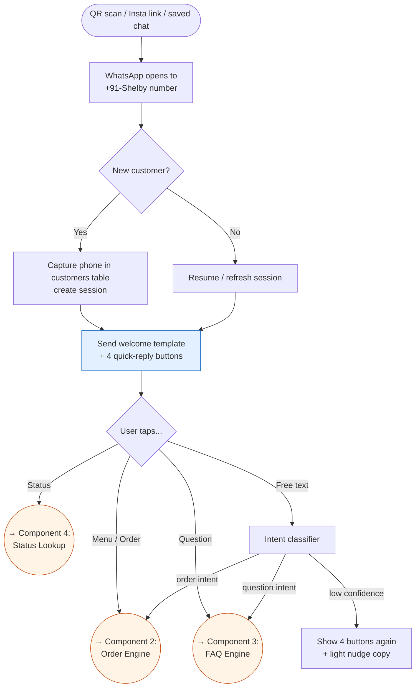
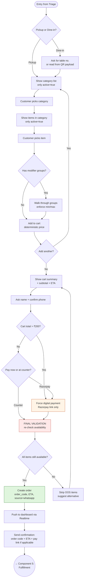
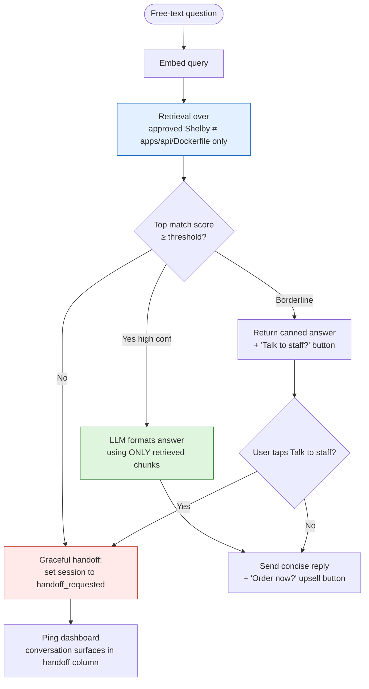
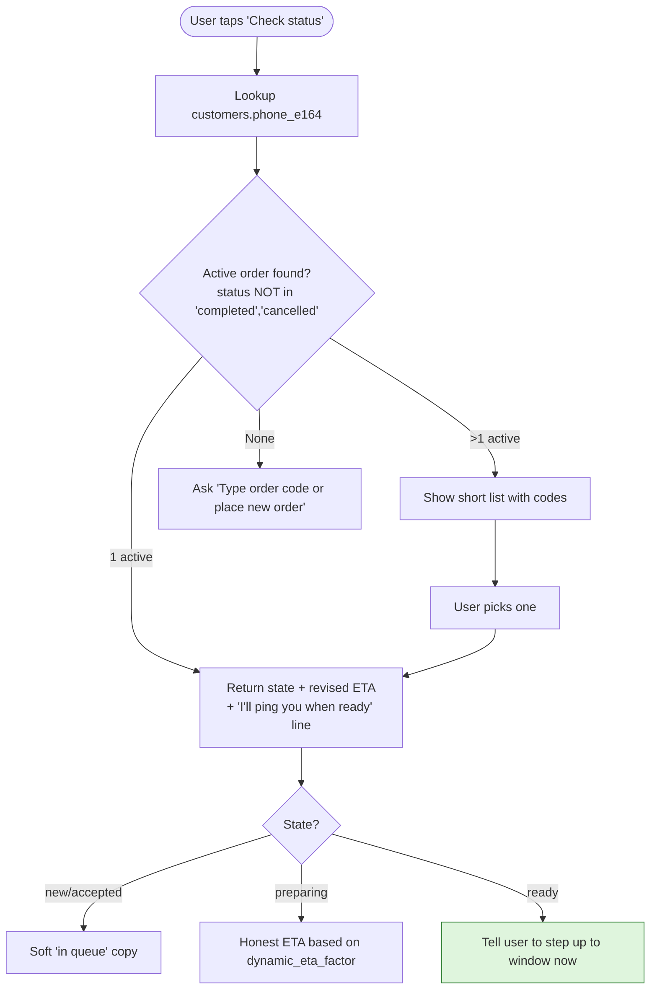
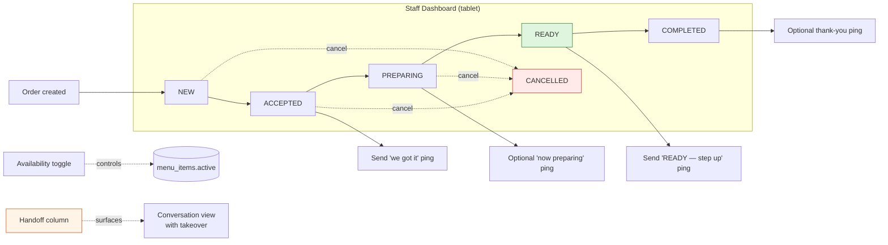
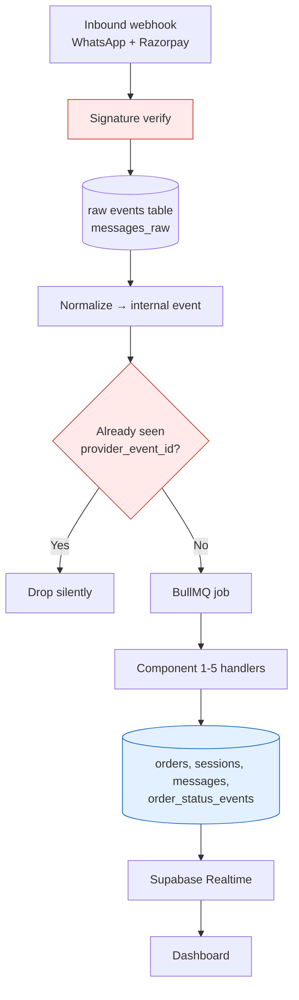

# DECK L1 — Component Breakdown
*Each box from the L0 macro flow opened up. Five components, each diagrammed and reviewed before we drill to L2.*

> **Reading order:** L0 → L1 (you are here) → L2. Every L1 component below begins with the L0 box it expands.

---

## Component 1 — Entry & Triage (expands L0: "Entry → Bot greets → 4 quick actions")

**Owner-readable description**
- Phone number = identity. No login, no app, no account.
- First-time customer is silently registered; returning customer keeps history.
- Four buttons are always one tap away — even if the user types something weird, we re-offer the buttons.

**Inputs:** WhatsApp inbound webhook
**Outputs:** routed to one of {Order Engine, FAQ Engine, Status Lookup}
**State written:** `customers`, `sessions`, `messages`

---

## Component 2 — Order Engine (expands L0: "Order Pickup / Dine-in")

**Why this design**
- **No AI in this entire flow.** Every price, every total, every availability check is deterministic database math.
- **Final validation is the safety net** — between "review cart" and "create order", we re-query availability so a barista's 1-second-ago toggle still wins.
- **₹200 cap on unpaid orders** kills the no-show abuse vector.
- **Order code** is short and human-readable (e.g., `SHL-241`) so it matches what staff already shout at the window.

**Inputs:** triaged session
**Outputs:** confirmed order in DB, customer notification, dashboard push
**State written:** `orders`, `order_items`, `order_item_modifiers`, `order_status_events`, `messages`

---

## Component 3 — FAQ Engine (expands L0: "Ask a Question")

**Pre-loaded KB chunks (must-have on day 1)**
- Hours of operation
- Exact location + parking note
- Vegan / oat milk availability + surcharge
- Payment modes (cash, UPI, card?)
- "Must-try" recommendations (Coffees, Hot Chocolate, Lemon Honey — straight from the board)
- Allergens / nut-free options
- **Rain protocol** ("It's raining, but our window is open!")
- Crowd / wait expectation
- Whether food (Korean Buns) is available today

**Owner-readable rules**
- Bot **never** answers from the open internet.
- Borderline questions get the canned "I'll connect you" path — bot is conservative on purpose.
- Every FAQ answer is tagged with the source document version, so the owner can audit later.

**Inputs:** free-text customer message
**Outputs:** concise reply, OR handoff to staff
**State written:** `messages`, `sessions.state` (may flip to `handoff_requested`)

---

## Component 4 — Status Lookup (expands L0: "Check Order Status")

**Inputs:** session, phone
**Outputs:** read-only status reply
**State written:** none (read-only path)

---

## Component 5 — Fulfillment & Staff Dashboard (expands L0: "Dashboard → Status updates → Window")

**Why Kanban (and not "auto-sequence")**
- The assembly line at Shelby is a *human* optimization. The dashboard is an **information radiator**, not a dispatcher.
- Staff sees aggregate demand (e.g., "5 teas in PREPARING across 3 orders") and batches naturally.
- Order moves to **READY** only when the *whole* order is built → preserves FCFS, prevents window crowding.

**Dashboard surfaces (one screen, four tabs)**
1. **Orders board** — Kanban, default view
2. **Menu availability** — one-tap toggle list, sorted by today's velocity
3. **Conversations / handoff** — chats flagged for human takeover
4. **Today** — orders count, avg ETA delta, FAQ deflection %, manual interventions

**Inputs:** confirmed orders from Order Engine, handoff flags from FAQ Engine
**Outputs:** customer notifications, status events
**State written:** `orders.status`, `order_status_events`, `menu_items.active`, `sessions` (when staff takes over)

---

## Cross-component infrastructure (the plumbing under all 5)

This plumbing is what makes the whole system **idempotent and replayable**. If WhatsApp re-delivers a webhook, we drop it. If a job crashes, we re-run it. If a dispute arises, we replay events from the raw log.

---

## Architect's Review — L1 (before going to L2)

**What the L1 view confirms:**
- The 5 components are **loosely coupled** — Order Engine doesn't know about FAQ Engine, FAQ Engine doesn't know about Dashboard. They communicate through the database + realtime channel.
- The **deterministic core** (Order Engine, Status Lookup, Dashboard) is fully separable from the **probabilistic edge** (FAQ Engine). If the LLM provider has an outage, ordering keeps working.
- Each component has a clear **single responsibility** and a clear **state boundary**.

**Two L1 decisions worth highlighting for the owner:**
1. **Final validation right before order creation** is the single most important micro-design choice. It is the reason "out-of-stock collisions" don't become refund headaches.
2. **Handoff is a state, not an interrupt.** When a customer needs a human, the bot goes silent and the chat surfaces in a dashboard column — staff doesn't get phone notifications, they just glance at the column. This matches Shelby's calm-amid-chaos operating style.

**Risks surfaced at L1 (carried forward to L2):**
- What happens if the dashboard is offline when an order arrives? *(answered in L2 micro-flow 5)*
- What happens if a customer abuses free-text? *(rate limit + spam guard at L2)*
- What about duplicate clicks on a button? *(idempotency at L2)*
- What if a payment webhook arrives *before* the order is created? *(out-of-order events at L2)*

→ Drilling into L2: each unhappy path mapped, every state transition diagrammed, every safety net wired.
