# DECK L2 — Micro Level: States, Edge Cases, Failure Modes, Safety Nets
*Where the system stops being a happy-path demo and becomes a real café tool. Every "what if" the owner is going to ask, mapped to a concrete behavior.*

> **Reading order:** L0 → L1 → L2 (you are here). Every micro-flow below cites the L1 component it lives inside.

---

## L2.1 — The Order State Machine (the spine)

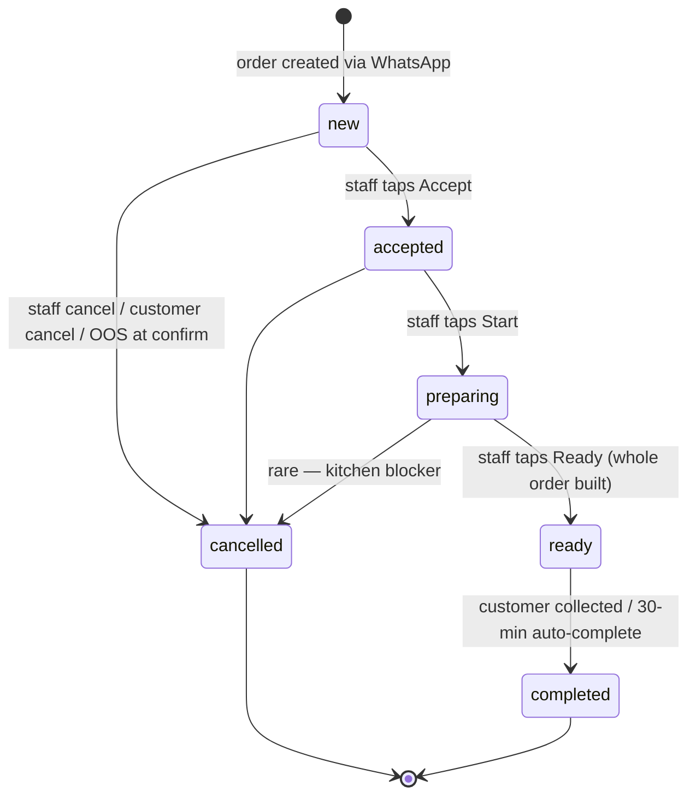

**Rules baked in:**
- `ready` requires the **whole** order to be built — preserves FCFS.
- Auto-complete after 30 min in `ready` (un-collected) keeps the board clean; customer gets a "did you collect?" ping.
- Every transition writes to `order_status_events` with actor (`staff` / `system`) — full audit trail.

---

## L2.2 — The Session State Machine (per phone number)

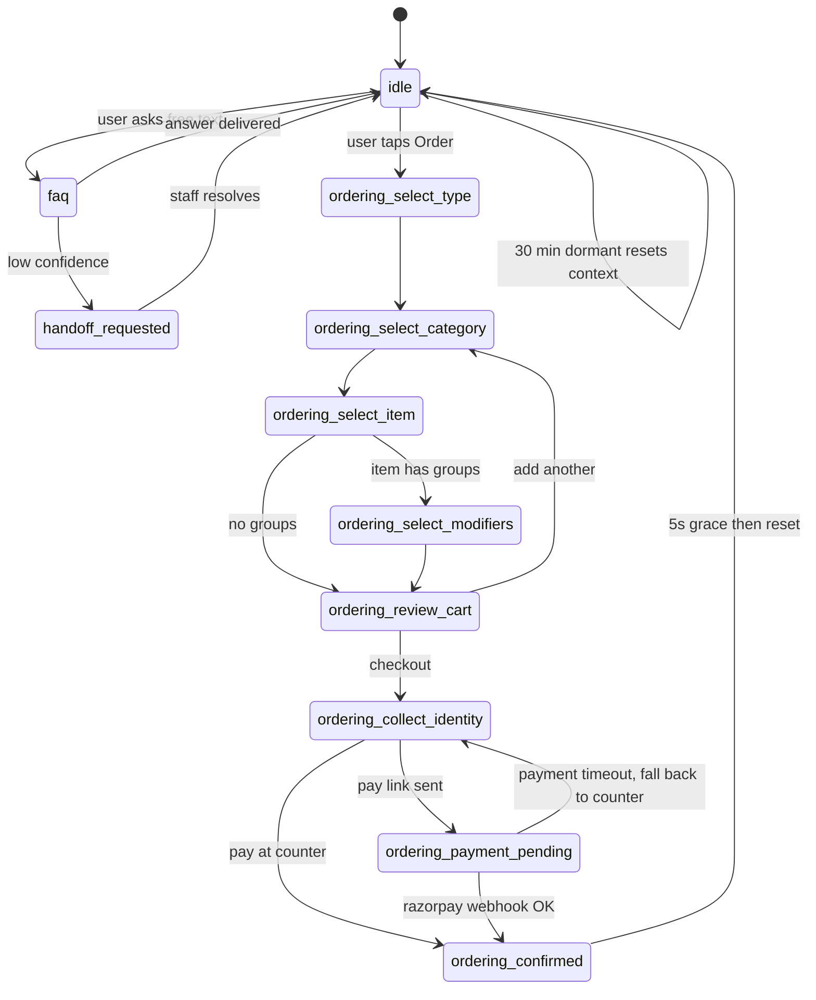

**Rules baked in:**
- 30-min dormancy clears context, restarts gracefully.
- `handoff_requested` mutes the bot for that phone until staff closes the chat in dashboard.
- Going **back** in the order flow is always allowed (browser-like back behavior).

---

## L2.3 — Micro-flow: Payment failure / drop-off (lives in **Order Engine**)

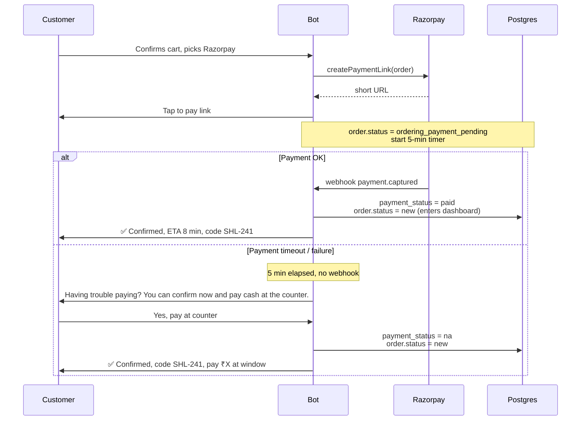

**Owner takeaway:** *we never lose the order to a payment glitch.*

---

## L2.4 — Micro-flow: Concurrent out-of-stock collision (lives in **Order Engine**)

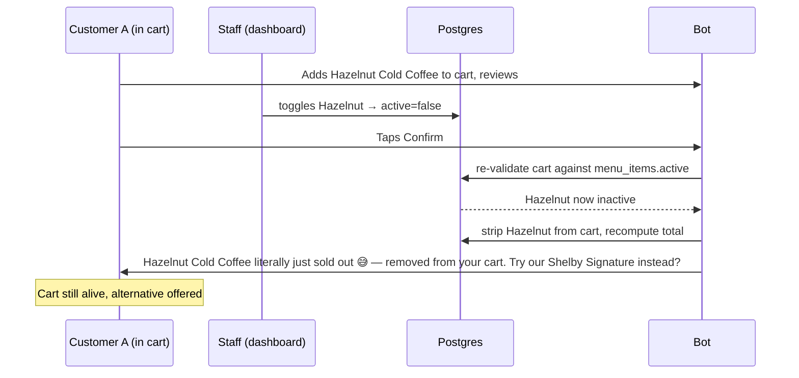

**Owner takeaway:** *no refunds, no counter arguments.*

---

## L2.5 — Micro-flow: Rush ETA inflation (lives in **Order Engine + Dashboard**)

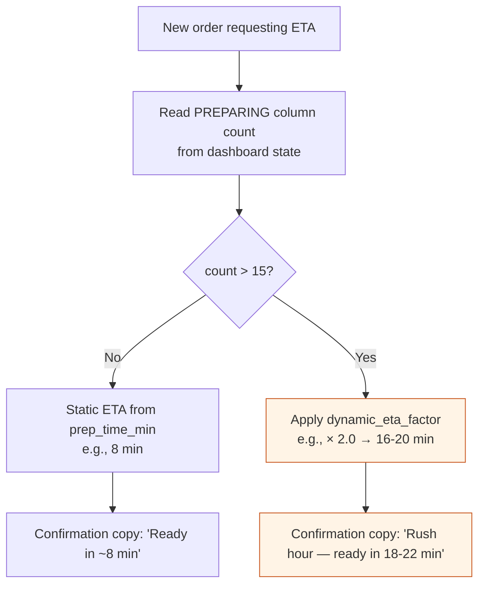

**Threshold formula (tunable by owner via settings):**
- `count ≤ 5` → factor 1.0
- `5 < count ≤ 15` → factor 1.3
- `count > 15` → factor 2.0

**Owner takeaway:** *The Great Disappointment is impossible. We tell people the truth before they pay.*

---

## L2.6 — Micro-flow: Lost / dormant chat (lives in **Triage**)

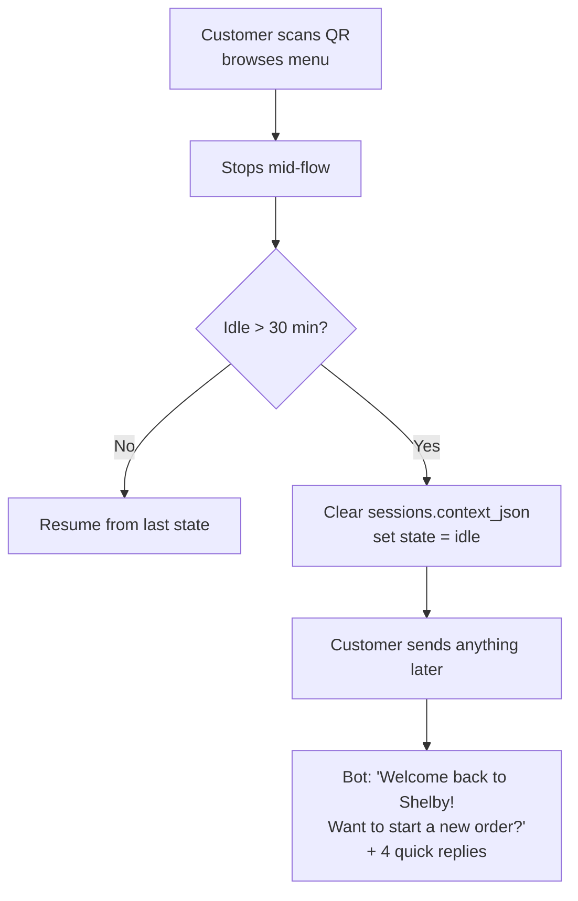

**Owner takeaway:** *no zombie carts, no confused 'I ordered yesterday and never got it' tickets.*

---

## L2.7 — Micro-flow: No-WhatsApp / cash-only / digital-shy customer

This is **not a software flow.** It is a deliberate non-flow.

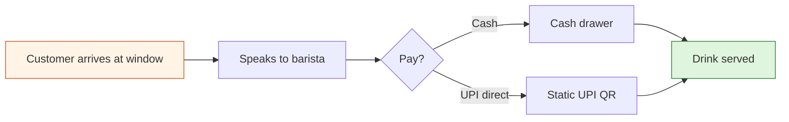

**Rule:** *the digital lane is never required.* The owner can tell every walk-in: "Order at the window like always, or scan the QR if you want to skip the line — your choice."

---

## L2.8 — Micro-flow: Total internet failure in the kiosk

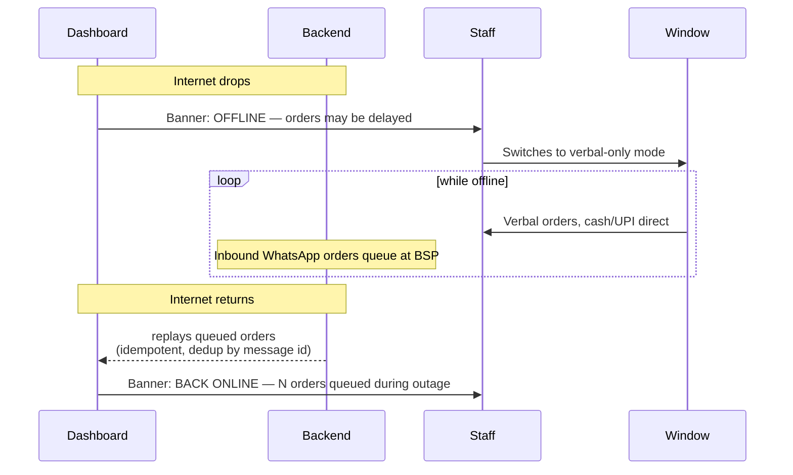

**Owner takeaway:** *coffee never stops being made. The internet outage costs us digital orders during the window, not customers.*

---

## L2.9 — Micro-flow: Multi-item order, FCFS preserved

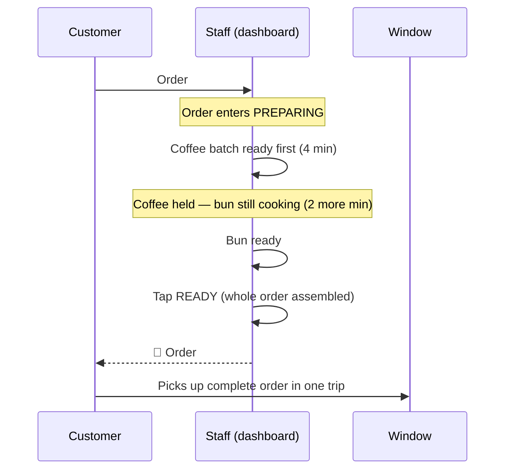

**Why we don't notify per item:**
- Customer would crowd the window twice.
- Defeats Shelby's 90% FCFS promise — earlier full orders should be handed over before later partial ones.
- Adds burden on staff (manage half-customers at window).

---

## L2.10 — Micro-flow: Tea-vs-coffee batching during rush

The system **does not** sequence prep. It just radiates information.

```
Dashboard PREPARING column at 18:42 (rush)
─────────────────────────────────────────
SHL-241  1× Hazelnut Coffee   1× Korean Bun
SHL-242  2× Masala Tea
SHL-243  1× Ginger Tea        1× Lemon Honey (tea)
SHL-244  1× Caramel Coffee
SHL-245  3× Normal Tea         1× Hot Chocolate
SHL-246  1× Shelby Signature
```

Tea master glances → sees **6 teas across 3 orders** → brews them as one batch → ticks each order's tea component done in their head → orders flip to READY when fully built.

**Owner takeaway:** *the system respects the assembly line; it doesn't fight it.*

---

## L2.11 — Micro-flow: Fake/no-show order risk

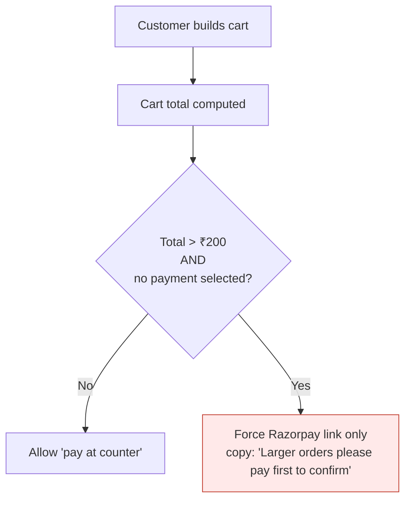

Plus: per-phone rate limiting on order creation (e.g., max 3 unpaid pending orders).

---

## L2.12 — Micro-flow: Rain protocol

```mermaid
flowchart TD
  R[Owner taps RAIN MODE on dashboard] --> R1[system_settings.rain_protocol_active = true]
  R1 --> R2[Bot prepends 'It's raining but our window is open ☂️' to all replies]
  R1 --> R3[FAQ engine prioritizes the rain answer]
  R1 --> R4[Optional: broadcast to opted-in customers from last 7 days]
  Note over R4: Phase 2 — requires opt-in compliance
```

---

## L2.13 — Micro-flow: Duplicate webhook / double-tap idempotency

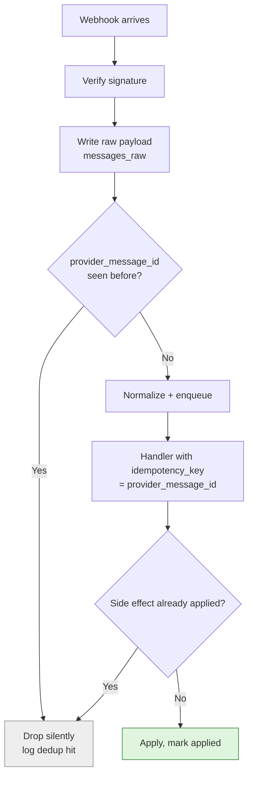

**Owner takeaway:** *if the customer taps "confirm" three times in a panic, we make ONE order, not three.*

---

## L2.14 — Micro-flow: Out-of-order events (rare but possible)

Scenario: Razorpay webhook arrives **before** we've finished writing the order to DB.

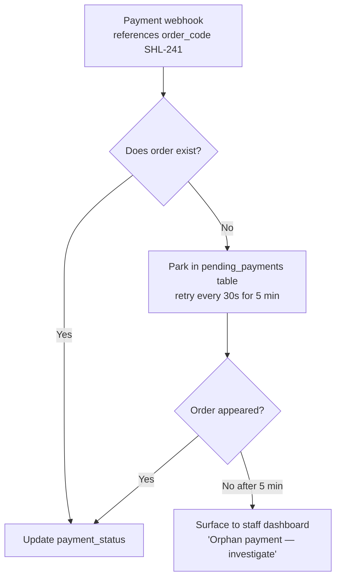

---

## L2.15 — Micro-flow: Manual handoff (lives in **FAQ Engine + Dashboard**)

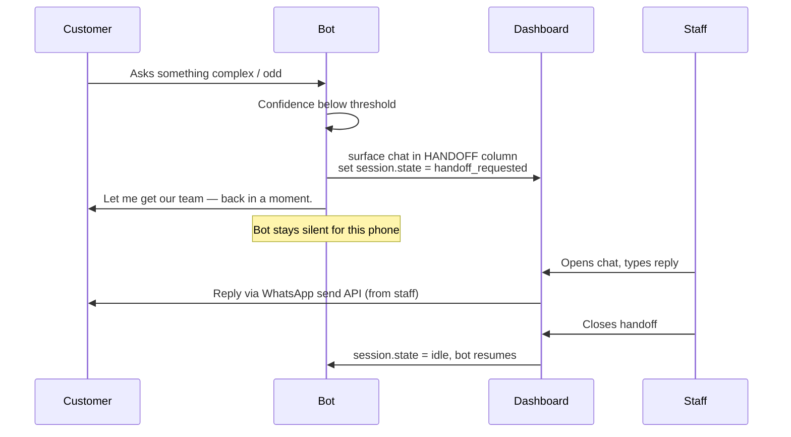

**Owner takeaway:** *the bot knows when to shut up.*

---

## L2.16 — Spam / abuse guard

| Trigger | Action |
|---|---|
| >5 inbound messages from same phone in 10s | Soft rate limit, "give us a sec" canned reply |
| Same phone >50 inbound/hour | Silent drop after that hour |
| Free-text contains link / URL | Auto-flag, route to handoff column |
| Phone reports order then no-shows 3 times | Block from "pay at counter" path; force digital pay |

---

## L2.17 — Pause-the-digital-lane kill switch

One toggle in dashboard → `system_settings.digital_lane_paused = true` → bot replies to all inbound:

> *"We're a bit slammed right now and have paused new WhatsApp orders for the next 10 minutes. Please walk up to the window — we're still serving!"*

**Use cases:** kitchen overwhelmed, ingredient delivery delayed, staff shortage, system flaky.

---

## L2.18 — Order code & physical alignment

The Order ID printed in the WhatsApp confirmation **must match** what staff shouts at the window.

| Source | Format |
|---|---|
| Counter (today) | Verbal first name, e.g., "Rahul, Hazelnut!" |
| Digital order | `SHL-241` short code |
| **Reconciliation** | When digital order moves to READY, dashboard shows **"SHL-241 — Rahul"** so staff can shout either; customer received both their first name and the code in confirmation |

---

## Architect's Final Review — L2

**What L2 confirms:**
- Every L1 happy path has a paired unhappy path with concrete behavior.
- The system has **5 kill switches** for the owner: availability toggle (per item), rain mode, digital-lane pause, dynamic ETA factor, and handoff column. None of them require an engineer.
- Idempotency, dedup, and replay are present at every boundary that touches money or state.
- The physical lane is preserved in 4 explicit places (no-WhatsApp, cash, internet down, owner pause).

**Two L2 decisions worth highlighting for the owner:**
1. **Order-level READY notification** is more important than any other single behavior. It is the difference between "calm window" and "shouting at the line."
2. **The dashboard is the single place an owner can affect the system in real time** — no engineer phone call required for any operational lever.

**Open items for pilot tuning (not architectural — operational):**
- Exact thresholds for `dynamic_eta_factor` (5 / 15 / 25?)
- Exact cart cap for unpaid (₹200? ₹250?)
- Whether to surface the Korean Bun upsell on every order over ₹100
- Whether to ping a "thank you, rate us" message on `completed`

These are dials to turn during the 4-week pilot, not architectural decisions.

---

## L0 → L1 → L2: gap-closure checklist (final)

| Owner concern | L0 | L1 | L2 |
|---|---|---|---|
| "What if customer has no WhatsApp?" | Two-lane diagram | Triage doesn't block | L2.7 |
| "What if internet fails?" | — | — | L2.8 |
| "What if payment fails?" | — | Order Engine path | L2.3 |
| "What if item runs out mid-cart?" | — | Final validation step | L2.4 |
| "What if peak hour?" | Success metric | Dashboard radiates demand | L2.5, L2.10 |
| "Will FCFS be respected?" | Single window | Order-level state | L2.9 |
| "What if AI is wrong?" | — | FAQ Engine confidence + handoff | L2.15 |
| "What if the customer abuses it?" | — | Cart cap | L2.11, L2.16 |
| "What if it rains?" | — | Rain answer in FAQ KB | L2.12 |
| "Can I pause the whole thing?" | — | — | L2.17 |
| "Will my staff get confused at window?" | — | Order-code reconciliation | L2.18 |

Every owner concern from the source materials is now closed at one of L0/L1/L2. ✓
